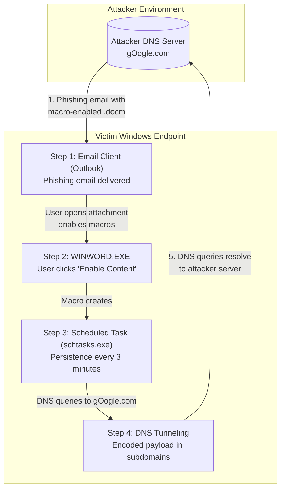
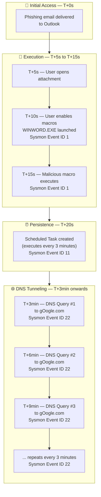
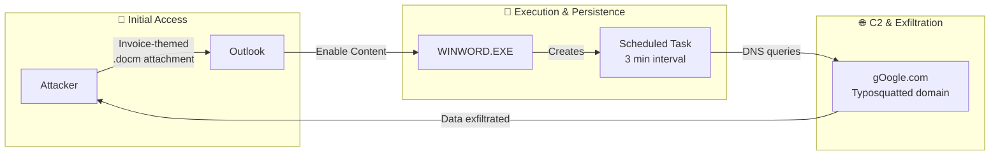
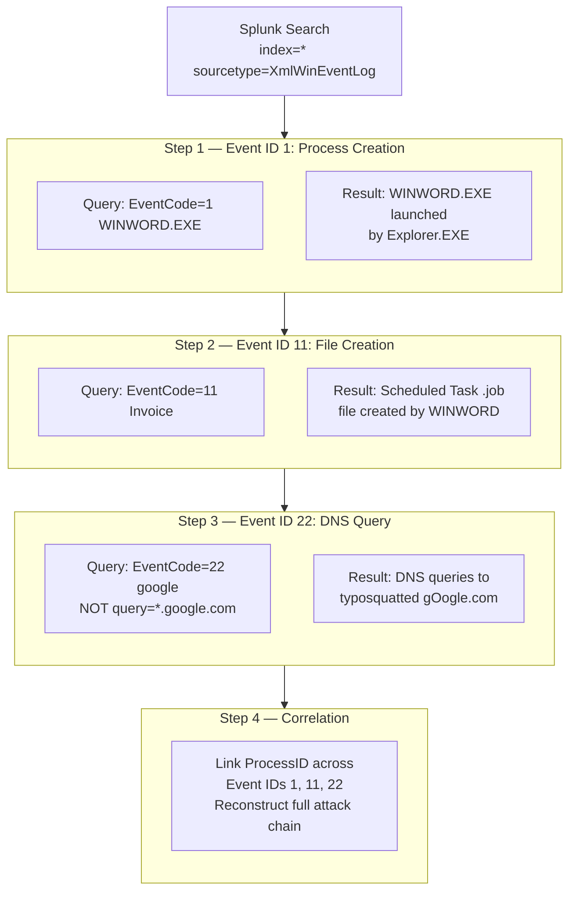

# 🚨 Windows Endpoint Investigation #2 | Detecting DNS Tunneling via Typosquatting Using Sysmon & Splunk

> *"It's just a Google DNS request... but it was gOogle.com, not google.com 😄"*

**Role:** SOC Analyst (Blue Team / DFIR)  
**Environment:** Isolated Windows Security Lab  
**Objective:** Reconstruct attacker activity from Windows Security Logs & Sysmon telemetry before the ransomware note appeared.

---

## Table of Contents

- [Attack Scenario Architecture](#attack-scenario-architecture)
- [Attack Timeline](#attack-timeline)
- [Investigation with Splunk](#investigation-with-splunk)
- [Splunk Search Queries](#splunk-search-queries)
- [MITRE ATT&CK Mapping](#mitre-attck-mapping)
- [Key Takeaways](#key-takeaways)
- [Screenshots](#screenshots)

---

## Attack Scenario Architecture



---

## Attack Timeline



---

### Attack Flow Summary



---

## Investigation with Splunk

### Sysmon Event IDs Used

| Event ID | Description      | Detection Point                        |
|----------|------------------|----------------------------------------|
| 1        | Process Creation | WINWORD.EXE launched from macro        |
| 11       | FileCreate       | Scheduled Task .job file written       |
| 22       | DNS Query        | Repeated queries to gOogle.com         |

### Detection Workflow



---

## Splunk Search Queries

### 1️⃣ Detected Initial Execution — WINWORD.EXE launched

```spl
index=* sourcetype="XmlWinEventLog:Microsoft-Windows-Sysmon/Operational"
EventCode=1 WINWORD.EXE
| table _time, Computer, User, Image, CommandLine, ParentImage
```

**Purpose:** Identify when WINWORD.EXE was launched and which parent process spawned it.

### 2️⃣ Identified Persistence — Scheduled Task Creation

```spl
index=* sourcetype="XmlWinEventLog:Microsoft-Windows-Sysmon/Operational"
EventCode=11 Invoice
| table _time, Computer, User, Image, TargetFilename
```

**Purpose:** Detect file creation events related to Scheduled Task persistence triggered by the macro.

### 3️⃣ Detected Suspicious DNS Activity — Typosquatted Domain

```spl
index=* sourcetype="XmlWinEventLog:Microsoft-Windows-Sysmon/Operational"
EventCode=22 google
| search NOT query="*.google.com"
| table _time, Computer, User, Image, QueryName, QueryResults
```

**Purpose:** Find DNS queries containing "google" that do NOT resolve to legitimate google.com — revealing the typosquatted gOogle.com domain.

---

## MITRE ATT&CK Mapping

| Tactic                | Technique ID   | Technique Name                | How It Was Used                            |
|-----------------------|----------------|-------------------------------|--------------------------------------------|
| 📧 Initial Access     | T1566.001      | Spearphishing Attachment      | Invoice-themed email with .docm payload    |
| 👤 Execution          | T1204.002      | User Execution: Malicious File | User enabled macros in Word document       |
| ⏰ Persistence        | T1053.005      | Scheduled Task                | Macro created task repeating every 3 min   |
| 💻 Execution          | T1059.001      | PowerShell                    | Macro likely used PowerShell for payload   |
| 🌐 Command & Control  | T1071.004      | DNS                           | Data exfiltrated via DNS queries           |
| 🔒 Exfiltration       | T1001          | Data Obfuscation              | Encoded data hidden in DNS subdomains      |

---

## Key Takeaways

✅ Reconstructed the attack chain using **Sysmon Event IDs 1, 11 & 22**  
✅ Detected **Scheduled Task persistence** created by a malicious macro  
✅ Identified **DNS tunneling** hidden behind a **typosquatted domain** (gOogle.com)  
✅ Correlated seemingly unrelated events across process trees  
✅ Practiced **Threat Hunting**, **Windows Forensics**, **Splunk SPL**, and **MITRE ATT&CK Mapping**

> This investigation reminded me that not every DNS request is as innocent as it looks.  
> Sometimes the biggest indicator isn't malware running on the endpoint — it's a *"normal"* DNS query repeating every few minutes.

---

## Screenshots

### Attack Scenario Architecture


### Sysmon Event ID 1 — WINWORD.EXE Process Creation


### Sysmon Event ID 11 — Scheduled Task Persistence (Invoice)


### Sysmon Event ID 22 — DNS Tunneling to Typosquatted Domain


---

🛡️ *Looking forward to building more hands-on Blue Team investigations and sharpening my incident response skills.*
