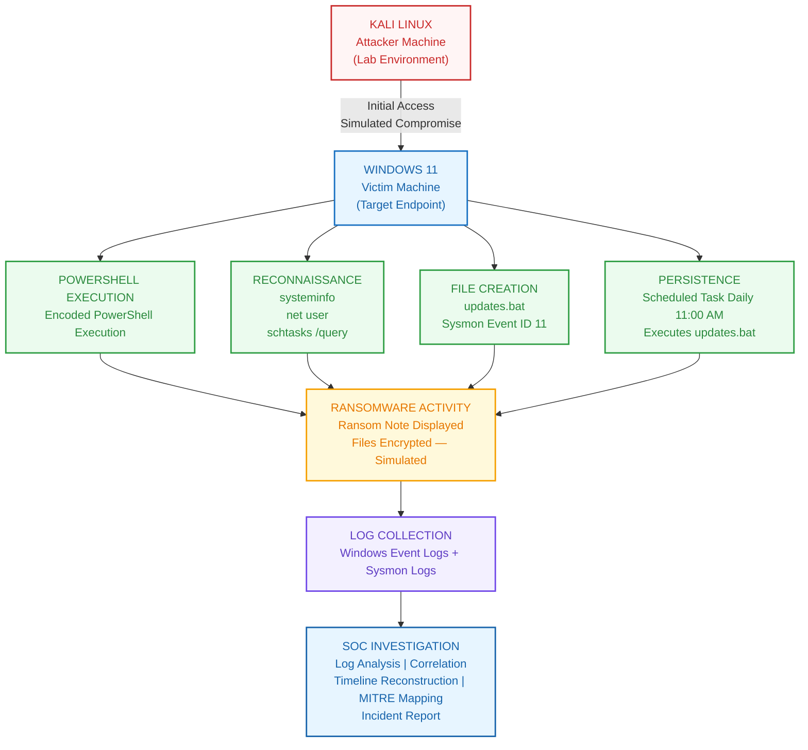

# 🚨 Windows Endpoint Investigation #1 — Simulated Ransomware Incident Analysis

> **Role:** SOC Analyst (Blue Team / DFIR)  
> **Environment:** Isolated Windows Security Lab  
> **Objective:** Reconstruct attacker activity from Windows Security Logs & Sysmon telemetry before the ransomware note appeared.

---

## 🔍 Investigation Overview

This lab simulates a ransomware-style attack on a Windows endpoint. The focus is **not** on exploitation techniques, but on **post-compromise forensic analysis** — answering the core questions every SOC analyst must ask:

<table>
  <thead>
    <tr>
      <th align="left">Question</th>
      <th align="left">How We Answered</th>
    </tr>
  </thead>
  <tbody>
    <tr>
      <td>🔹 <strong>Who accessed the endpoint?</strong></td>
      <td>Event ID 4624 — Logon analysis</td>
    </tr>
    <tr>
      <td>🔹 <strong>What happened after compromise?</strong></td>
      <td>Sysmon Event ID 1 — Process chain</td>
    </tr>
    <tr>
      <td>🔹 <strong>What evidence was left behind?</strong></td>
      <td>Sysmon Event ID 11 — File creation artifacts</td>
    </tr>
    <tr>
      <td>🔹 <strong>How was persistence established?</strong></td>
      <td>Scheduled Task analysis</td>
    </tr>
    <tr>
      <td>🔹 <strong>Can the timeline be reconstructed?</strong></td>
      <td>Correlation of all telemetry sources</td>
    </tr>
  </tbody>
</table>

---

## 🏗️ Attack Scenario Architecture



---

## 🖼️ Screenshot Evidence Map

<table>
  <thead>
    <tr>
      <th align="center">#</th>
      <th align="left">Screenshot</th>
      <th align="left">Event / Artifact</th>
      <th align="left">What It Shows</th>
    </tr>
  </thead>
  <tbody>
    <tr>
      <td align="center">1</td>
      <td><code>01-Event-4624-Successful-Logon.png</code></td>
      <td>🟢 <strong>Event 4624</strong></td>
      <td>Successful logon — user account, logon type, authentication method, Logon ID</td>
    </tr>
    <tr>
      <td align="center">2</td>
      <td><code>02-Sysmon-EID1-Encoded-PowerShell.png</code></td>
      <td>⚙️ <strong>Sysmon EID 1</strong></td>
      <td>Encoded PowerShell execution (initial payload)</td>
    </tr>
    <tr>
      <td align="center">3</td>
      <td><code>03-Sysmon-EID1-systeminfo.png</code></td>
      <td>🖥️ <strong>Sysmon EID 1</strong></td>
      <td><code>systeminfo</code> — system discovery</td>
    </tr>
    <tr>
      <td align="center">4</td>
      <td><code>04-Sysmon-EID1-net-user.png</code></td>
      <td>👥 <strong>Sysmon EID 1</strong></td>
      <td><code>net user</code> — user enumeration</td>
    </tr>
    <tr>
      <td align="center">5</td>
      <td><code>05-Sysmon-EID1-schtasks-query.png</code></td>
      <td>📋 <strong>Sysmon EID 1</strong></td>
      <td><code>schtasks /query</code> — scheduled task enumeration</td>
    </tr>
    <tr>
      <td align="center">6</td>
      <td><code>06-Sysmon-EID11-updates-bat.png</code></td>
      <td>📄 <strong>Sysmon EID 11</strong></td>
      <td><code>updates.bat</code> file creation</td>
    </tr>
    <tr>
      <td align="center">7</td>
      <td><code>07-Scheduled-Task-Persistence.png</code></td>
      <td>⏰ <strong>Scheduled Task</strong></td>
      <td>Persistence — daily trigger at 11:00 AM</td>
    </tr>
    <tr>
      <td align="center">8</td>
      <td><code>08-Ransomware-Note.png</code></td>
      <td>💀 <strong>Ransomware Note</strong></td>
      <td>Simulated impact — ransom note displayed</td>
    </tr>
  </tbody>
</table>

---

## 🕒 Attack Timeline

```mermaid
timeline
    title Simulated Ransomware Attack Chain
    11:16 : Successful Logon (4624) : User authentication confirmed
    11:18 : Encoded PowerShell Execution : Malicious payload launched
    11:21 : System Discovery (systeminfo) : Reconnaissance phase
    11:21 : User Enumeration (net user) : Account discovery
    11:21 : Task Enumeration (schtasks /query) : Persistence recon
    11:21 : updates.bat Created : Malicious batch file written to disk
    12:27 : Scheduled Task Set : Daily 11:00 AM trigger configured
    12:29 : Ransomware Note Displayed : Impact / end of simulation
```

> See the **Attack Scenario Architecture** diagram above for the full attack flow from initial access through SOC investigation.

---

## 🎯 MITRE ATT&CK Mapping

<table>
  <thead>
    <tr>
      <th align="left">Technique ID</th>
      <th align="left">Name</th>
      <th align="left">Phase Detected</th>
    </tr>
  </thead>
  <tbody>
    <tr>
      <td><strong>T1059.001</strong></td>
      <td>Command and Scripting Interpreter: PowerShell</td>
      <td>Execution</td>
    </tr>
    <tr>
      <td><strong>T1082</strong></td>
      <td>System Information Discovery</td>
      <td>Discovery</td>
    </tr>
    <tr>
      <td><strong>T1087.001</strong></td>
      <td>Account Discovery: Local Account</td>
      <td>Discovery</td>
    </tr>
    <tr>
      <td><strong>T1053.005</strong></td>
      <td>Scheduled Task/Job: Scheduled Task</td>
      <td>Discovery &amp; Persistence</td>
    </tr>
    <tr>
      <td><strong>T1486</strong></td>
      <td>Data Encrypted for Impact</td>
      <td>Impact <em>(Simulated)</em></td>
    </tr>
  </tbody>
</table>

---

## 💡 Key Takeaways

> **A single Event ID rarely tells the complete story.**  
> Effective investigations come from **correlating multiple telemetry sources** — Windows Security Logs + Sysmon — to reconstruct attacker behavior and build an **evidence-based timeline**.

- ✅ **Event 4624** only tells you *who* logged in
- ✅ **Sysmon EID 1** reveals *what* they executed
- ✅ **Sysmon EID 11** uncovers *what files* were dropped
- ✅ **Scheduled Task analysis** shows *how* they persisted
- ✅ **Correlation** of timestamps and Logon IDs reveals the *full narrative*

---

## 🛠️ Tools & Techniques Used

- 🔍 **Windows Event Viewer** — Security Log (4624 logon events)
- 🔍 **Sysmon** — Process creation (EID 1) & file creation (EID 11) telemetry
- 🔍 **PowerShell** — Decoding base64-encoded payloads
- 🔍 **Task Scheduler** — Persistence mechanism analysis
- 🔍 **Timeline correlation** — Cross-referencing Logon IDs & process parent-child relationships

---

## 📁 Repository Structure

```
📦 Windows-Event-Log-Investigation
 ┣ 📂 Screenshots/
 ┃ ┣ 🖼️ 01-Event-4624-Successful-Logon.png
 ┃ ┣ 🖼️ 02-Sysmon-EID1-Encoded-PowerShell.png
 ┃ ┣ 🖼️ 03-Sysmon-EID1-systeminfo.png
 ┃ ┣ 🖼️ 04-Sysmon-EID1-net-user.png
 ┃ ┣ 🖼️ 05-Sysmon-EID1-schtasks-query.png
 ┃ ┣ 🖼️ 06-Sysmon-EID11-updates-bat.png
 ┃ ┣ 🖼️ 07-Scheduled-Task-Persistence.png
 ┃ ┗ 🖼️ 08-Ransomware-Note.png
 ┗ 📄 README.md       # Investigation report (this file)
```

---

## 🙌 Feedback & Contributions

This project is part of a **SOC Analyst learning journey**.  
Feedback, suggestions, and improvements are always welcome!

---

*Built for learning, by a learner. #CyberSecurity #SOCAnalyst #BlueTeam #DFIR #ThreatHunting #IncidentResponse*
